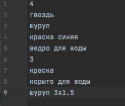
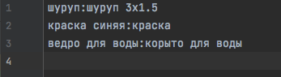

# string_matcher
The program compares the most similar strings from the first set with the strings from the second set and outputs the result to file.

The java-string-similarity library is used, namely [Ratcliff/Obershelp Pattern Recognition](https://github.com/tdebatty/java-string-similarity#ratcliff-obershelp):


```javascript 
<dependency>
      <groupId>info.debatty</groupId>
      <artifactId>java-string-similarity</artifactId>
      <version>RELEASE</version>
</dependency>
``` 

___
input example:



output example:


